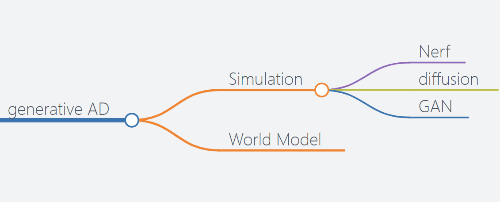

# Awesome-GenerativeModel4AD-Survey

A curated list of Generative Models in Autonomous Driving. Keep Update.

# Papers

## Simulation

### Nerf

+ [Editable Scene Simulation for Autonomous Driving via Collaborative LLM-Agents](https://arxiv.org/abs/2402.05746) (Feb., 2024) 

  
  
   
   

### Diffusion 

+ [BEVControl: Accurately Controlling Street-view Elements with Multi-perspective Consistency via BEV Sketch Layout](https://arxiv.org/abs/2308.01661) (Apr., 2023) 

  
   

+ [MagicDrive: Street View Generation with Diverse 3D Geometry Control](https://arxiv.org/abs/2310.02601) (Apr., 2023)     

  
  
   

+ [Panacea: Panoramic and Controllable Video Generation for Autonomous Driving](https://arxiv.org/abs/2311.16813) (Nov., 2023) (CVPR2024) 

  
  
   

+ [DrivingDiffusion: Layout-Guided multi-view driving scene video generation with latent diffusion model](https://arxiv.org/abs/2310.07771) (Nov., 2023) 

  
  
   

### Others

+ [Street-View Image Generation from a Bird's-Eye View Layout](https://arxiv.org/abs/2301.04634) (Jan., 2023) 

  
  
   

## World Model

+ [DriveGAN: Towards a Controllable High-Quality Neural Simulation](https://arxiv.org/abs/2104.15060) (Apr., 2021) (CVPR2021) 

  
  
   

+ [Learning Unsupervised World Models for Autonomous Driving via Discrete Diffusion](https://arxiv.org/abs/2311.01017) (Nov., 2023) (ICLR2024) 

  
  
   

+ [MUVO: A Multimodal Generative World Model for Autonomous Driving with Geometric Representations](https://arxiv.org/abs/2311.11762) (Nov., 2023) (ICLR2024) 

  
  
   

<!-- + [EvalCrafter: Benchmarking and Evaluating Large Video Gen`eration Models](https://arxiv.org/abs/2310.11440) (Oct., 2023)      
  
  
   
    -->